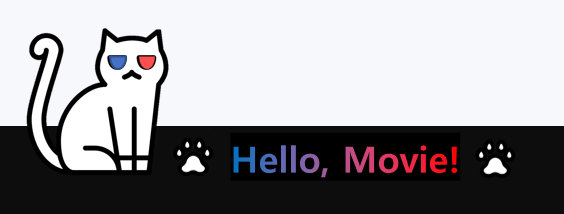
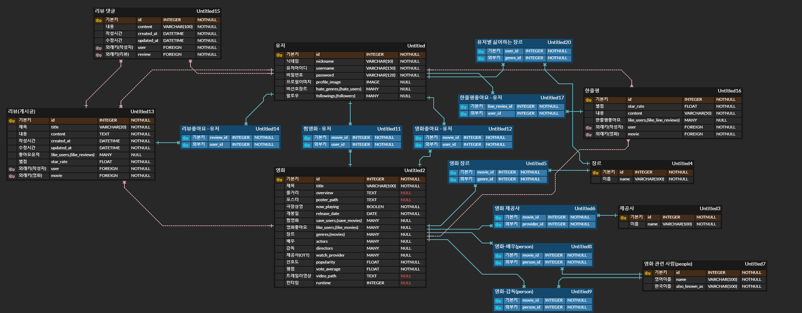
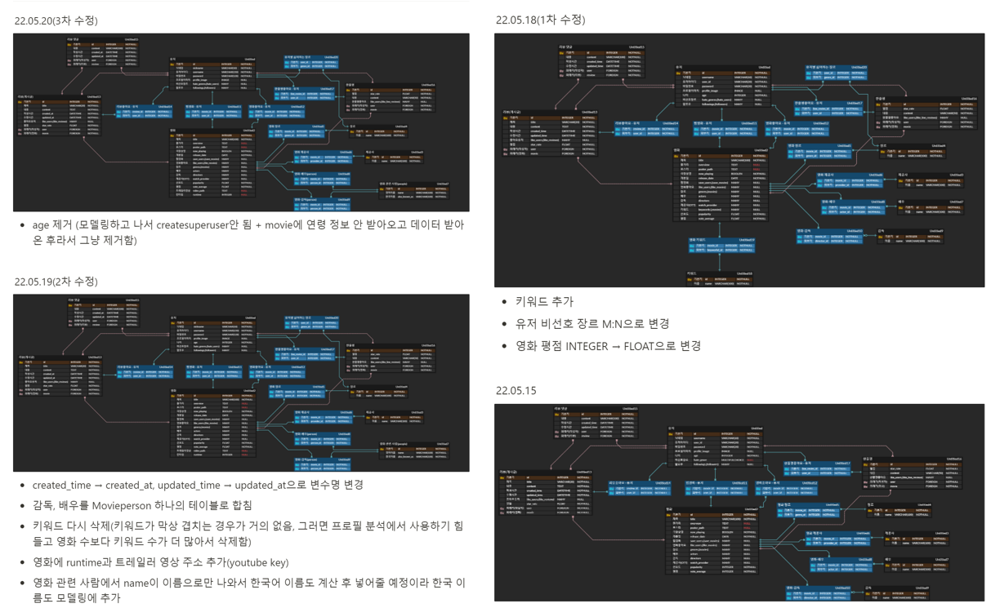
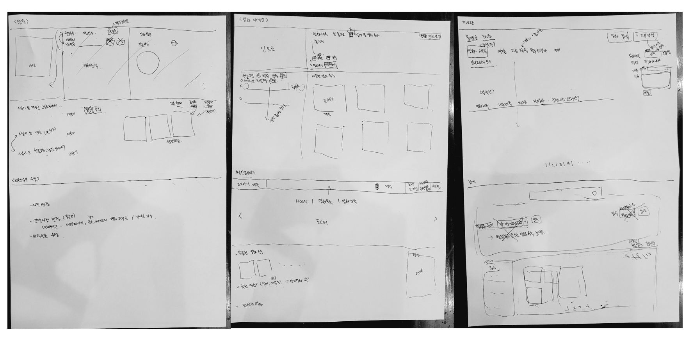
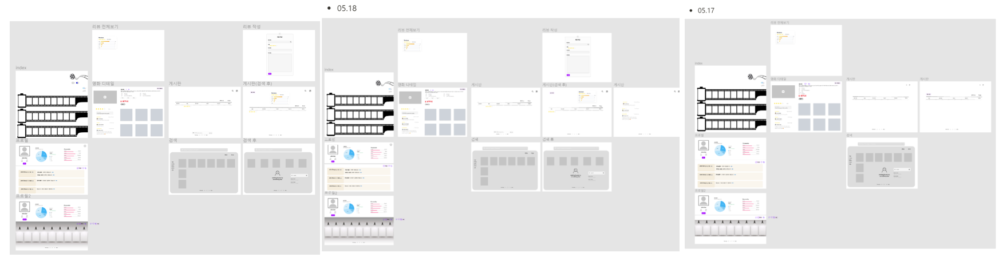
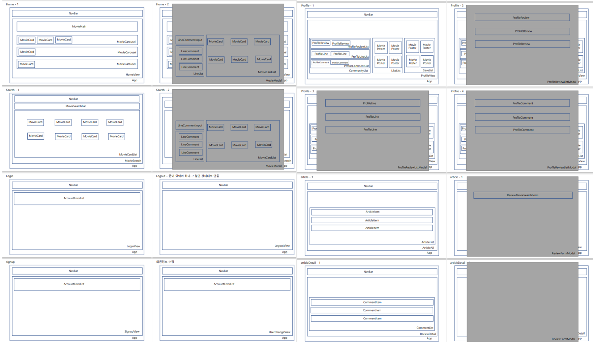

# README

## 팀원 정보

- 장세진 - 백엔드, 프론트엔드
- 최희선 - 백엔드, 프론트엔드

## 사용한 프레임워크

- django(back), vue(프론트)
- 사용한 api - tmdb, youtube

## 프로젝트 기간

2022.05.20~2022.05.26

## 컨셉

- 로고
  - 평온하게 영화를 보는 고양이와 영화를 즐길 준비가 된 상태임을 표현하는 문구로 정했습니다.
  - 고양이가 영화를 보는 것을 표현하기 위해 파란색과 빨간색을 이용했습니다.

- 누구나 편하게 이용할 수 있는 영화 추천 페이지(키워드 : 평안, 평온)
  - 보기 싫은 장르를 선택하면 그 장르는 보이지 않습니다.(필터링 진행)
  - 편하게 이용 가능하도록 페이지바(pagination), 화면 넘기기(carousel) 기능 구현했습니다.
  - 아이디를 공개하고 싶지 않는 유저를 위해 닉네임을 필수로 받은 후, 다름 사람이 조회, 검색 시에는 닉네임으로만 조회, 검색이 가능합니다.
- 전반적인 색상은 흰색, 검은색(회색), 파란색을 사용했습니다.

## 전반적인 구조

### - ERD 구조

- M:N 관계의 경우, 관계를 명확히 보여주기 위해 파란색 테이블로 작성했습니다.
- 상속관계가 1:N의 경우 핑크색 선으로 연결하고, M:N 관계의 경우 파란색 선으로 연결했습니다.
- 필드(fields 세부 설명)
  - 영화
    - 트레일러 영상이 보이기 위해 트레일러 영상 주소를 받았습니다.
  - 영화 관련 사람
    - 배우, 감독에 대한 정보가 들어있는 데이터
    - 사람 이름이 영어로 나와서 한국 이름이 제공된 경우에는 also_known_as에 따로 저장했습니다.
  - 장르
    - 유저가 싫어하는 장르를 선택할 수 있어야 하므로 M:N 관계로 설정
  - 유저
    - 닉네임을 받기 위해 커스텀 진행
  - 유저 - 영화
    - 좋아요 한 영화와 찜한 영화를 각각 구현

## 기능 설명(캡쳐) + dumpdata 한 방법 + 알고리즘 방법

##### 메인페이지

- 인기순, 높은 평점순, 현재 상영중인 영화를 20개씩 메인 페이지에서 보여주고 있습니다.

  - KNN(K-Nearest Neighbor)알고리즘을 사용하여 협업필터링 기반  맞춤형 추천 알고리즘을 작성하였습니다.

    - vue에서 사용자 정보와 함께 정보를 요청하면 django의 view에서 작업하여 나온 데이터를 vue로 보내주는 형식으로 진행

    - 모든 리뷰를 사용자 별로 영화 Id와 별점을 저장해 딕셔너리로 만들었습니다.

    - 만들어진 딕셔너리에 나의 리뷰가 하나라도 있으면(내가 리뷰를 하나라도 작성했다면), 다른 사람과의 유사도를 계산합니다. db에 있는 모든 영화 데이터가 기준이 됩니다.
    
    - 평가 내린 영화가 다른 유저와 3개 이상 겹치면, 다른 유저들은 봤지만 나는 안 본 영화 데이터 배열에 다른 사람과 나와의 차집합을 넣어줍니다. 코사인 거리 공식으로 거리를 계산하고, neighbor에 나와 유사도가 비슷한 사람 순으로 pk값을 저장합니다. 유사도가 높은 5명(K=5)만 확인을 하여 추천도를 계산하고 높은 순으로 15개를 보여줍니다.
    

##### 상세 페이지

  - 메인 페이지 혹은 검색 페이지에서 영화 포스터를 선택하면 상세 페이지가 모달로 열릴 수 있도록 구현하였습니다.
  - 상세 페이지 상단에는 영화의 트레일러 영상, 제목, 줄거리, 평점 등 미리 DB에 저장해 놓은 데이터를 api로 받아서 보여줍니다.
  - 상세 페이지 하단에는 이 영화와 비슷한 영화 6개를 보여줍니다.

    - 영화에 대해 좋아요를 누를 수 있고 찜하기를 누를 수도 있습니다.
      - 이 영화들은 프로필에서 조회 가능합니다.
  - 영하에 대한 별점과 간단한 한줄평을 작성하고 상세페이지에서 다른 사람들의 한줄평을 조회할 수 있습니다.

- cgv 버튼을 누르면, 영화의 예매페이지가 존재한다면 영화의 예매페이지로 이동합니다. 
  - 셀레니움을 이용하여 영화의 예매페이지 주소를 넘겨주었습니다.
  - 현재 상영중인 영화라면 예매페이지로 바로 이동가능합니다. 
  - 현재 상영중인 영화가 아니라면 검색 결과가 없다는 페이지가 뜹니다. 

##### 영화 검색 페이지

  - 영화 검색 페이지에서는 영화 혹은 배우(한국 이름으로도 검색 가능)를 검색하여 영화 정보를 얻을 수 있으며, 장르를 선택하여 장르별로 영화를 모아서 볼 수 있습니다.

  - 장르별 영화는 다시 평점순과 최신순으로 구분하여 볼 수 있습니다.

##### 회원가입, 로그인, 로그아웃

  - 유저정보에 nickname과 hategenre, 프로필 사진을 추가할 수 있기 때문에 회원가입은 따로 커스텀 해주었습니다.

  - 로그인, 로그아웃

##### 게시판

  - 게시판은 모든 리뷰가 있는 메인 게시판과 영화 별로 조회 가능한 영화 별 게시판이 있습니다.

  - 메인 게시판에는 최신 순, 좋아요 순으로 리뷰를 조회 할 수 있고, 리뷰 제목을 검색 하여 원하는 리뷰로 이동할 수 있습니다.

  - 메인 게시판에서 영화별 검색을 이용하여 특정 영화 게시판으로 이동이 가능합니다.

  - 리뷰 조회, 작성, 수정, 삭제가 가능하며 리뷰에 대한 댓글 역시 조회, 작성, 수정, 삭제가 가능합니다.

  - 댓글과 리뷰 모두 작성시각과 수정 시각을 조회할 수 있습니다.

  - 리뷰에 대해 좋아요를 할 수 있습니다.

##### 회원정보 수정

  - 회원 가입 시 에는 아이디, 비밀번호, 닉네임만 입력해도 가입이 가능하고 이후에 추가적으로 싫어하는 장르를 선택할 수 있습니다.
    - 싫어하는 장르를 선택하면,
      - 메인 페이지의 추천 리스트에도 이 장르가 하나라도 포함된 영화는 추천 되지 않습니다.
      - 검색 페이지에서 이 장르에 해당하는 장르 별 버튼이 사라집니다. 하지만, 검색은 가능합니다.

  - 회원 정보 수정 페이지에서 프로필 사진도 추가하거나 수정할 수 있습니다.

##### 프로필 페이지

  - 자신의 프로필과 다른 유저들의 프로필을 조회 할 수 있습니다.
  - 프로필 페이지에서는 자신이 남긴 게시글과 댓글을 조회할 수 있으며, 자신이 좋아요 한 영화와 저장한 영화 역시 조회 가능합니다.

##### 데이터

- django 데이터데이스(db)에 저장된 데이터
  - 영화 목록 3995개, 영화 장르 19개, 영화 인물 24015개  추출하고 리뷰, 유저 관련하여 데이터 생성 후 django 데이터베이스에 저장했습니다.

- 데이터 추출 방법
  - django에서 바로 작업하기 위해서 1. 모델링 후 2. url과 tmdb에서 api를 받아오기 위해 views.py를 작성하고 3. django 서버에서 tmdb로 접근하여 받은 정보를 django db에 넣어주었습니다.

---

## 처음 의도, 실제 구현 정도

- 영화 추천 사이트에서 영화에 대한 자세한 정보와 사용자 기반 영화 추천 서비스를 제공하여 언제 어디서나 영화를 즐길 준비가 되도록 도와주고 싶었습니다.
- 일부 랭킹 시스템 및 디자인적인 부분에서는 구상했던 대로 다 구현하지 못했습니다.

---

## 배운점, 실수했던 점, 까다로웠던 점

유저 커스텀

- 회원가입에 대해 Django에서 제공하는 라이브러리를 쓰는 대신 커스텀을 진행하였다면, Django에서 지원해주는 회원가입시에는 비인증 사용자도 접근이 가능하도록 하는 기능은 사용할 수 없습니다. 이 경우 직접 view함수에서 AllowAny라는 데코레이터를 추가하여 비인증된 사용자도 접근이 가능해지도록 해야 합니다.

모델링

- 유저별 싫어하는 장르에서 테이블간의 관계를 잘못 생각했습니다. 장르와 영화는 M:N 관계이고, 영화와 유저간도 M:N 관계입니다.

데이터 추출

- 상속관계의 경우 한쪽 테이블을 채워준 후 접근 해야 합니다. 즉 영화- 장르라고 가정하면 장르 데이터를 저장하지 않고 영화의 장르를 저장하려고 하면 foreignkey에러 발생합니다.
- 영화에서 출연진을 접근 시 이름을 영어로 줘서 그 인물에 대한 데이터를 다시 요청 후 그 중에서 한국어 이름을 추출했습니다.

싫어하는 장르 기능 구현

- 싫어하는 장르를 유저가 회원정보에서 수정이 가능하게 하는 것과 실제 페이지에서 그 장르들의 영화를 제거해주는 작업이 생각보다 까다로웠습니다. 특히 싫어하는 장르를 여러 개 선택할 수 있고, 그 장르들을 다 제거해야 했습니다.

검색 기능 구현

- vue에서 검색이 가능하도록 하는 기능과 django에서 검색(클래스 뷰함수 사용)이 가능하도록 하는 기능 둘 다 진행했습니다. vue에서의 경우 보이는 데이터들의 검색만 가능하다는 점과 django에서는 숨은 데이터까지 추출할 수 있다는 차이점이 있었습니다. 다시 말해서 배우를 검색하면 그 배우가 나온 영화들의 제목을 검색값으로 얻을 수 있습니다.

영화 예매 페이지

- 백에 영화제목을 넘겨주어야 하는데 비동기식이다 보니, 예매페이지를 반환하는 함수가 먼저 실행되 이전에 받아왔던 영화제목으로 예매페이지가 이동되는 문제가 발생하였습니다. 이 함수를 실행할 시간을 설정해주어 문제를 해결하였습니다.

---

## 노력했던 작업 흔적들(페이지 만든거랑 figma)

ERD

- 프로젝트를 진행하면서 그에 맞게 수정, 삭제, 추가 작업 진행했습니다.

초기 페이지 구상

- 주요 페이지 손으로 그려가면서 구상했습니다.
- 특히 영화 디테일 부분을 가장 신경 쓰면서 작성했습니다.

피그마 작업

- 결론부터 말하자면, figma랑 CSS랑 연결하는 방법을 찾지 못해 활용하지 못했습니다.
- 나름 시간을 많이 투자한 부분이라서 아쉽지만, Vue에서 페이지 작업시 참고자료로 활용했습니다.

component 초기 구상

- 프로젝트를 진행하면서 수정했습니다.

---

## 느낀 점

- 장세진

  - 지난 한 학기 동안 배웠던 것을 영화 추천 사이트라는 하나의 주제를 통해 직접 Django와 Vue를 연결하고 추천알고리즘을 구현하고 각각의 기능들을 구현하면서 Vue와 Django에 더 익숙해질 수 있었던 것 같습니다. 

  - 모델링, 데이터 추출, 페이지 및 기능 구현 등 무엇 하나 쉬웠던 것이 없었고 다양한 문제상황을 마주하였습니다. 문제를 해결하려 고민하고 시도하면서 많은 부분 배울 수 있었습니다.   그 과정에서 팀원 분과 계속 소통하면서 문제를 해결해 나갈 수 있었습니다.  문제상황을 마주하였을때 팀원과 같이 진행하면서 몰랐던 부분, 부족했던 부분을 채워나갈 수 있었고 그 과정에서 소통의 중요성을 알게 되었습니다. 또한 혼자 하는 것보다 같이 함으로써 얻을 수 있는 시너지가 있다는 것을 또 한번 더 알게 된 계기가 된 것 같습니다. 

  - git을 사용하면서 git에 더 익숙해지는 계기가 되었습니다. 

  - 시간 상의 문제로 초기에 기획했던 부분을 다 구현하지 못해 많은 아쉬움이 남았지만 이번 프로젝트를 통해 성장할 수 있었습니다.

    

- 최희선
  - 협업을 하면서 소통의 중요성을 다시 한번 크게 느꼈습니다. 현재 나의 진행 사항, 막히는 부분이 있을 때 바로 도움을 청하는 것, 팀원이 도움 요청했을 때 같이 해결해가려는 의지 등 많은 부분을 배웠습니다. 또한 좋은 팀원을 만나 같이 힘을 내서 진행 할 수 있었던거 같습니다.
  - 기존에 배운 방식이 아닌 새로운 방식을 사용할 때, 고민하고 검색하고 구현하는 과정에서 많은 성장을 할 수 있었습니다.
  - 적극적으로 아이디어를 주고받아 구현하고 싶은 기능이 더욱 많았지만 시간 상의 문제로 다 구현하지 못해서 아쉬움이 남습니다.
  - 기술적인 부분에서 vue-django가 어떤식으로 연결하는지 제대로 배울 기회였고, 모르는 기술에 대해 검색하는 능력, 디버깅하는 능력에 대해 배울 수 있었습니다. 또한 추천 알고리즘을 구현하는 과정에서 현업에서 사용하는 추천 알고리즘에 대해 공부할 수 있었고 이를 바탕으로 실제로 구현도 해볼 수 있었습니다.
  - 단지 이번 프로젝트를 완성하는 것에 그치지 않고 다양하게 시도하고 부딪쳤습니다. 그 과정에서 많은 상황을 만나면서 성장할 수 있었습니다.